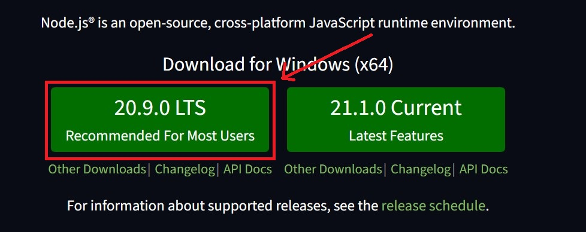
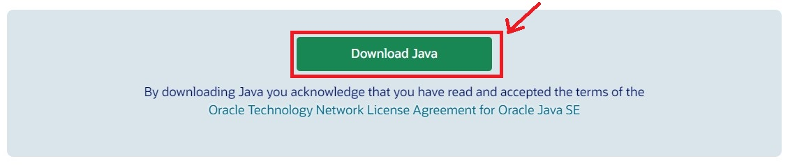

# Playwright tests

Playwright tests Automated Tests for https://www.redmine.org/ with Playwright and Allure Reporting.

## Table of Contents
1. [Summary](#summary)
2. [Requirements](#requirements)
3. [Installation](#installation)
4. [Usage](#usage)

## Summary
This repository contains automated tests for https://www.redmine.org/ using the Playwright framework. The test results are reported using Allure reporting.

## Requirements
- Node.js (v14.17.3 or higher)
- Java (JRE 8 or higher)
- Playwright (v1.17.1 or higher)
- Allure Framework (v2.15.0 or higher)

All the requirements except Node.js and Java can be downloaded throught using this command after cloning repository:
    ```
    npm install
    ```

Please make sure you have the necessary dependencies installed and the environment properly configured before running the tests. You can customize the tests in the [tests](tests) directory and configure the Playwright options in the [config](playwright.config.js) file as needed.

## Installation
1. Make sure Node.js is installed:
    - If you don't have Node.js installed, download and install it from the official [Node.js website](https://nodejs.org/en).
    - Choose next button after going throguht the link to download LTS version.
    - 
    - After download is finished run the installer.
    - After installation, verify that Node.js and npm (Node Package Manager) are correctly installed by running the following commands in your terminal:
     ```
     node -v
     npm -v
     ```
    - You should see version numbers displayed, indicating that Node.js and npm are installed.

2. Make sure Java is installed:
    - If you don't have Java installed, download and install it from the official [Java Download Page](https://www.java.com/en/download/ie_manual.jsp).
    - Choose next button after going throguht the link to download LTS version.
    - 
    - After download is finished run the installer.
    - Than add installation directory (by default "C:\Program Files (x86)\Java\jre-1.8\" on Windows) to the PATH variable.
    - In Search, search for and then select: System (Control Panel)
    - Click the Advanced system settings link.
    - Click Environment Variables. In the section System Variables find the PATH environment variable and select it. Click Edit. If the PATH environment variable does not exist, click New.
    - In the Edit System Variable (or New System Variable) window, specify the value of the PATH environment variable. Click OK. Close all remaining windows by clicking OK.
    - Reopen Command prompt window, and run your java code.
    - Next, verify that Java is correctly installed by running the following command in your terminal:
     ```
     java -version
     ```
    - You should see the installed Java version displayed.

3. Clone this repository to your local machine.
    ```
    git clone https://github.com/wasadar/testing-redmine-s-site-with-playwright-framework.git
    ```

4. Navigate to the project directory.
    ```
    cd testing-redmine-s-site-with-playwright-framework
    ```

5. Install the required dependencies.
    ```
    npm install
    ```

## Usage
### Running Tests
To run the automated tests using Playwright, you can use the following npm scripts defined in the `package.json` file:

- Run the automated tests using Playwright (headless mode):
    ```
    npm test
    ```

- Run the automated tests using Playwright with a graphical user interface (UI):
    ```
    npm run test-with-ui
    ```

Choose the appropriate script based on your testing needs.

### Generating Reports
To generate and view reports, you can use the following npm scripts:

- Generate the Allure report:
    ```
    npm run generate-allure-report
    ```

- Open the Allure report in your default web browser:
    ```
    npm run open-allure-report
    ```

The test results will be saved in the "playwright-report" directory for Allure reporting. Make sure to configure your tests and reporting as needed in the project's configuration files and the Allure configuration.